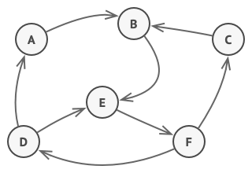
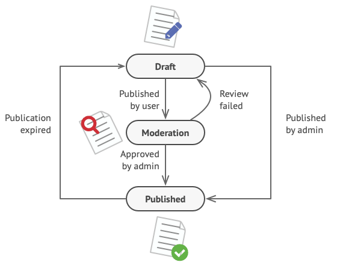
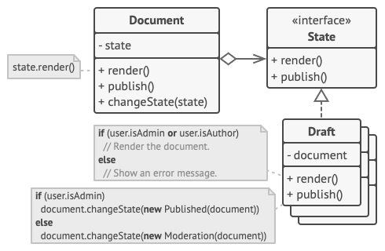

# State
## Intent
State is a behavioral design pattern that lets an object alter its behavior when its internal state changes. It appears as if the object changed its class.

### State Design Pattern
### Problem
The State pattern is closely related to the concept of a Finite-State Machine.



Finite-State Machine
Finite-State Machine.

The main idea is that, at any given moment, there’s a finite number of states which a program can be in. Within any unique state, the program behaves differently, and the program can be switched from one state to another instantaneously. However, depending on a current state, the program may or may not switch to certain other states. These switching rules, called transitions, are also finite and predetermined.

You can also apply this approach to objects. Imagine that we have a Document class. A document can be in one of three states: Draft, Moderation and Published. The publish method of the document works a little differently in each state:

In Draft, it moves the document to moderation.
In Moderation, it makes the document public, but only if the current user is an administrator.
In Published, it doesn’t do anything at all.
Possible states of a document object
Possible states and transitions of a document object.



State machines are usually implemented with lots of conditional statements (if or switch) that select the appropriate behavior depending on the current state of the object. Usually, this “state” is just a set of values of the object’s fields. Even if you’ve never heard about finite-state machines before, you’ve probably implemented a state at least once. Does the following code structure ring a bell?

```java


class Document is
field state: string
// ...
method publish() is
switch (state)
"draft":
state = "moderation"
break
"moderation":
if (currentUser.role == 'admin')
state = "published"
break
"published":
// Do nothing.
break
// ...
```
The biggest weakness of a state machine based on conditionals reveals itself once we start adding more and more states and state-dependent behaviors to the Document class. Most methods will contain monstrous conditionals that pick the proper behavior of a method according to the current state. Code like this is very difficult to maintain because any change to the transition logic may require changing state conditionals in every method.

The problem tends to get bigger as a project evolves. It’s quite difficult to predict all possible states and transitions at the design stage. Hence, a lean state machine built with a limited set of conditionals can grow into a bloated mess over time.

Solution
The State pattern suggests that you create new classes for all possible states of an object and extract all state-specific behaviors into these classes.

Instead of implementing all behaviors on its own, the original object, called context, stores a reference to one of the state objects that represents its current state, and delegates all the state-related work to that object.

Document delegates the work to a state object
Document delegates the work to a state object.



To transition the context into another state, replace the active state object with another object that represents that new state. This is possible only if all state classes follow the same interface and the context itself works with these objects through that interface.

This structure may look similar to the Strategy pattern, but there’s one key difference. In the State pattern, the particular states may be aware of each other and initiate transitions from one state to another, whereas strategies almost never know about each other.

# Real-World Analogy
The buttons and switches in your smartphone behave differently depending on the current state of the device:

When the phone is unlocked, pressing buttons leads to executing various functions.
When the phone is locked, pressing any button leads to the unlock screen.
When the phone’s charge is low, pressing any button shows the charging screen.

# Applicability
1.
Use the State pattern when you have an object that behaves differently depending on its current state, the number of states is enormous, and the state-specific code changes frequently.

The pattern suggests that you extract all state-specific code into a set of distinct classes. As a result, you can add new states or change existing ones independently of each other, reducing the maintenance cost.
 
2
Use the pattern when you have a class polluted with massive conditionals that alter how the class behaves according to the current values of the class’s fields.

The State pattern lets you extract branches of these conditionals into methods of corresponding state classes. While doing so, you can also clean temporary fields and helper methods involved in state-specific code out of your main class.

3.
Use State
when you have a lot of duplicate code across similar states and transitions of a condition-based state machine.

The State pattern lets you compose hierarchies of state classes and reduce duplication by extracting common code into abstract base classes.