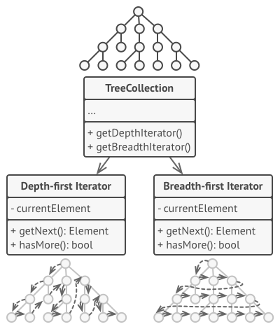

# Iterator
## Intent
Iterator is a behavioral design pattern that lets you traverse elements of a collection without exposing its underlying representation (list, stack, tree, etc.).

# Problem
Collections are one of the most used data types in programming. Nonetheless, a collection is just a container for a group of objects.

Most collections store their elements in simple lists. However, some of them are based on stacks, trees, graphs and other complex data structures.

But no matter how a collection is structured, it must provide some way of accessing its elements so that other code can use these elements. There should be a way to go through each element of the collection without accessing the same elements over and over.

This may sound like an easy job if you have a collection based on a list. You just loop over all of the elements. But how do you sequentially traverse elements of a complex data structure, such as a tree? For example, one day you might be just fine with depth-first traversal of a tree. Yet the next day you might require breadth-first traversal. And the next week, you might need something else, like random access to the tree elements.

Adding more and more traversal algorithms to the collection gradually blurs its primary responsibility, which is efficient data storage. Additionally, some algorithms might be tailored for a specific application, so including them into a generic collection class would be weird.

On the other hand, the client code that’s supposed to work with various collections may not even care how they store their elements. However, since collections all provide different ways of accessing their elements, you have no option other than to couple your code to the specific collection classes.

# Solution
The main idea of the Iterator pattern is to extract the traversal behavior of a collection into a separate object called an iterator.

In addition to implementing the algorithm itself, an iterator object encapsulates all of the traversal details, such as the current position and how many elements are left till the end. Because of this, several iterators can go through the same collection at the same time, independently of each other.

Usually, iterators provide one primary method for fetching elements of the collection. The client can keep running this method until it doesn’t return anything, which means that the iterator has traversed all of the elements.

All iterators must implement the same interface. This makes the client code compatible with any collection type or any traversal algorithm as long as there’s a proper iterator. If you need a special way to traverse a collection, you just create a new iterator class, without having to change the collection or the client.

# Real-World Analogy

You plan to visit Rome for a few days and visit all of its main sights and attractions. But once there, you could waste a lot of time walking in circles, unable to find even the Colosseum.

On the other hand, you could buy a virtual guide app for your smartphone and use it for navigation. It’s smart and inexpensive, and you could be staying at some interesting places for as long as you want.

A third alternative is that you could spend some of the trip’s budget and hire a local guide who knows the city like the back of his hand. The guide would be able to tailor the tour to your likings, show you every attraction and tell a lot of exciting stories. That’ll be even more fun; but, alas, more expensive, too.

All of these options—the random directions born in your head, the smartphone navigator or the human guide—act as iterators over the vast collection of sights and attractions located in Rome.

# Applicability
Use the Iterator pattern when your collection has a complex data structure under the hood, but you want to hide its complexity from clients (either for convenience or security reasons).

The iterator encapsulates the details of working with a complex data structure, providing the client with several simple methods of accessing the collection elements. While this approach is very convenient for the client, it also protects the collection from careless or malicious actions which the client would be able to perform if working with the collection directly.

Use the pattern to reduce duplication of the traversal code across your app.

The code of non-trivial iteration algorithms tends to be very bulky. When placed within the business logic of an app, it may blur the responsibility of the original code and make it less maintainable. Moving the traversal code to designated iterators can help you make the code of the application more lean and clean.

Use the Iterator when you want your code to be able to traverse different data structures or when types of these structures are unknown beforehand.

The pattern provides a couple of generic interfaces for both collections and iterators. Given that your code now uses these interfaces, it’ll still work if you pass it various kinds of collections and iterators that implement these interfaces.

