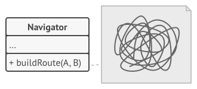
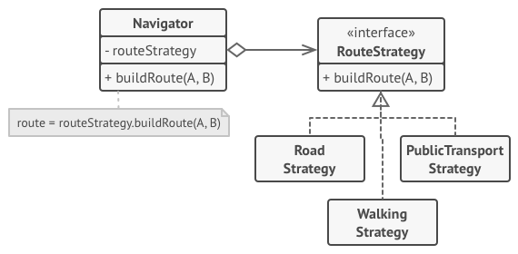
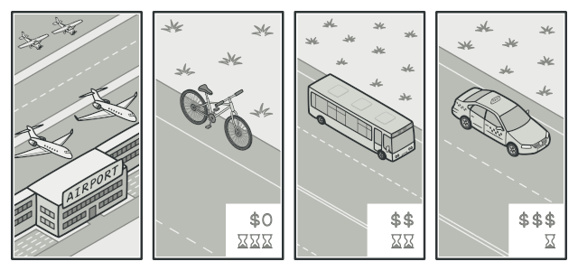

# Strategy Pattern

Strategy is a behavioral design pattern that lets you define a family of algorithms, put each of them into a separate class, and make their objects interchangeable.

## Problem
One day you decided to create a navigation app for casual travelers. The app was centered around a beautiful map which helped users quickly orient themselves in any city.

One of the most requested features for the app was automatic route planning. A user should be able to enter an address and see the fastest route to that destination displayed on the map.

The first version of the app could only build the routes over roads. People who traveled by car were bursting with joy. But apparently, not everybody likes to drive on their vacation. So with the next update, you added an option to build walking routes. Right after that, you added another option to let people use public transport in their routes.

However, that was only the beginning. Later you planned to add route building for cyclists. And even later, another option for building routes through all of a city’s tourist attractions.

While from a business perspective the app was a success, the technical part caused you many headaches. Each time you added a new routing algorithm, the main class of the navigator doubled in size. At some point, the beast became too hard to maintain.

Any change to one of the algorithms, whether it was a simple bug fix or a slight adjustment of the street score, affected the whole class, increasing the chance of creating an error in already-working code.

In addition, teamwork became inefficient. Your teammates, who had been hired right after the successful release, complain that they spend too much time resolving merge conflicts. Implementing a new feature requires you to change the same huge class, conflicting with the code produced by other people.

##  Solution
The Strategy pattern suggests that you take a class that does something specific in a lot of different ways and extract all of these algorithms into separate classes called strategies.

The original class, called context, must have a field for storing a reference to one of the strategies. The context delegates the work to a linked strategy object instead of executing it on its own.

The context isn’t responsible for selecting an appropriate algorithm for the job. Instead, the client passes the desired strategy to the context. In fact, the context doesn’t know much about strategies. It works with all strategies through the same generic interface, which only exposes a single method for triggering the algorithm encapsulated within the selected strategy.

This way the context becomes independent of concrete strategies, so you can add new algorithms or modify existing ones without changing the code of the context or other strategies.

In our navigation app, each routing algorithm can be extracted to its own class with a single buildRoute method. The method accepts an origin and destination and returns a collection of the route’s checkpoints.

Even though given the same arguments, each routing class might build a different route, the main navigator class doesn’t really care which algorithm is selected since its primary job is to render a set of checkpoints on the map. The class has a method for switching the active routing strategy, so its clients, such as the buttons in the user interface, can replace the currently selected routing behavior with another one.

# Real-World Analogy

Imagine that you have to get to the airport. You can catch a bus, order a cab, or get on your bicycle. These are your transportation strategies. You can pick one of the strategies depending on factors such as budget or time constraints.
# 

#  Applicability

Use the Strategy pattern when you want to use different variants of an algorithm within an object and be able to switch from one algorithm to another during runtime.

The Strategy pattern lets you indirectly alter the object’s behavior at runtime by associating it with different sub-objects which can perform specific sub-tasks in different ways.

Use the Strategy when you have a lot of similar classes that only differ in the way they execute some behavior.

The Strategy pattern lets you extract the varying behavior into a separate class hierarchy and combine the original classes into one, thereby reducing duplicate code.

Use the pattern to isolate the business logic of a class from the implementation details of algorithms that may not be as important in the context of that logic.

The Strategy pattern lets you isolate the code, internal data, and dependencies of various algorithms from the rest of the code. Various clients get a simple interface to execute the algorithms and switch them at runtime.

Use the pattern when your class has a massive conditional statement that switches between different variants of the same algorithm.

The Strategy pattern lets you do away with such a conditional by extracting all algorithms into separate classes, all of which implement the same interface. The original object delegates execution to one of these objects, instead of implementing all variants of the algorithm

